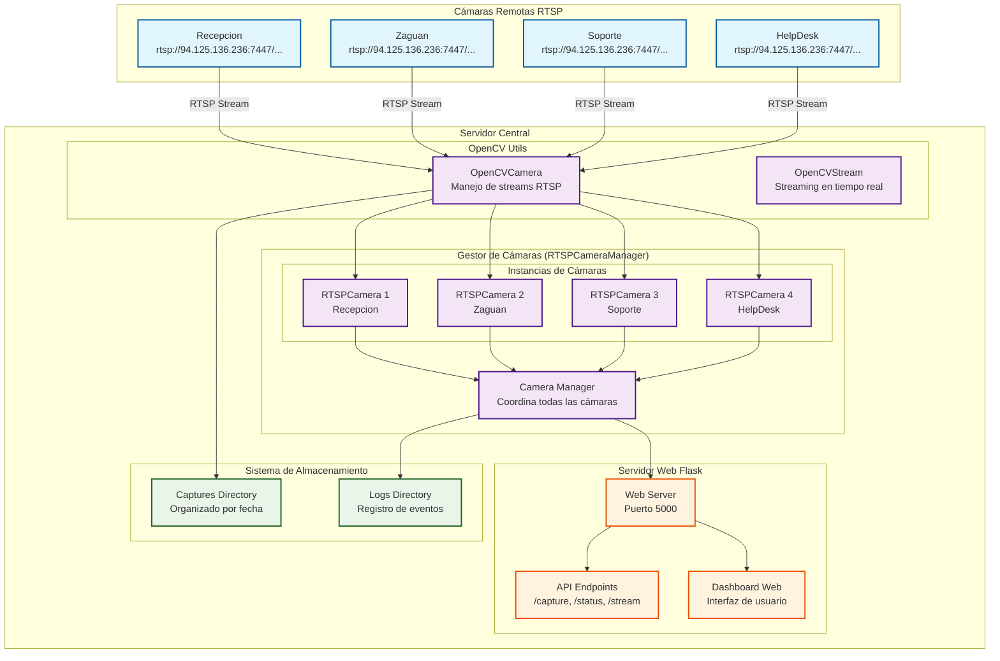
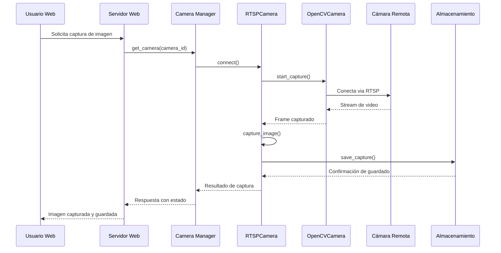
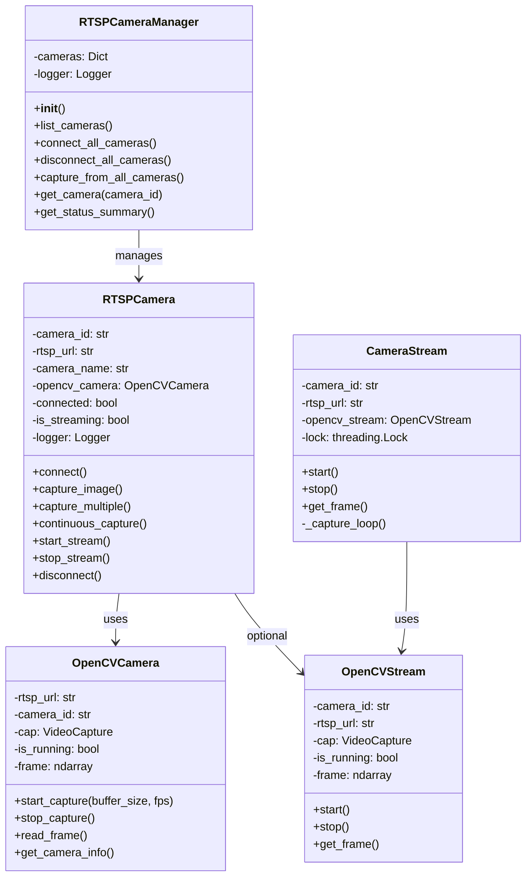
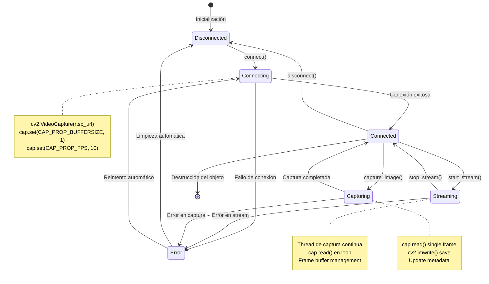

# Diagrama del Sistema de Obtención de Imágenes desde Cámaras Remotas RTSP

## Arquitectura del Sistema



## Flujo de Obtención de Imágenes



## Tipos de Captura Disponibles

```mermaid
graph LR
    subgraph "Tipos de Captura"
        SINGLE[Captura Única<br/>capture_image()]
        MULTIPLE[Captura Múltiple<br/>capture_multiple()]
        CONTINUOUS[Captura Continua<br/>continuous_capture()]
        STREAM[Stream en Tiempo Real<br/>start_stream()]
    end
    
    subgraph "Configuraciones"
        FORMAT[JPG - Calidad 95%]
        RES[1280x720]
        FPS[10 FPS]
        BUFFER[Buffer Size: 1]
    end
    
    subgraph "Almacenamiento"
        DATE[Organizado por fecha<br/>YYYYMMDD]
        SUBDIR[Subdirectorios<br/>all_cameras, multiple, etc.]
        NAMING[Prefijo: cam<br/>Timestamp: YYYYMMDD_HHMMSS]
    end
    
    SINGLE --> FORMAT
    MULTIPLE --> RES
    CONTINUOUS --> FPS
    STREAM --> BUFFER
    
    FORMAT --> DATE
    RES --> SUBDIR
    FPS --> NAMING
```

## **PROCESO INTERNO DEL CÓDIGO Y USO DE OPENCV**

### Arquitectura de Clases y Flujo de Datos



### Flujo Detallado de Captura con OpenCV

```mermaid
flowchart TD
    A[Usuario solicita captura] --> B[web_server.py: /capture endpoint]
    B --> C[RTSPCameraManager.get_camera()]
    C --> D[RTSPCamera.connect()]
    
    D --> E{¿Cámara ya conectada?}
    E -->|No| F[OpenCVCamera.start_capture()]
    E -->|Sí| G[Proceder a captura]
    
    F --> H[cv2.VideoCapture(rtsp_url)]
    H --> I[cap.set(CAP_PROP_BUFFERSIZE, 1)]
    I --> J[cap.set(CAP_PROP_FPS, 10)]
    J --> K{¿cap.isOpened()?}
    
    K -->|No| L[Error: No se pudo conectar]
    K -->|Sí| M[Conexión exitosa]
    
    M --> G
    G --> N[RTSPCamera.capture_image()]
    N --> O[OpenCVCamera.read_frame()]
    
    O --> P[cap.read()]
    P --> Q{¿ret == True?}
    Q -->|No| R[Error: Frame no válido]
    Q -->|Sí| S[Frame capturado exitosamente]
    
    S --> T[Procesar frame si es necesario]
    T --> U[Guardar imagen]
    
    U --> V[save_frame_to_file()]
    V --> W[cv2.imwrite()]
    W --> X[Imagen guardada en disco]
    
    X --> Y[Actualizar estado de cámara]
    Y --> Z[Respuesta al usuario]
    
    style A fill:#e1f5fe
    style F fill:#fff3e0
    style H fill:#fff3e0
    style I fill:#fff3e0
    style J fill:#fff3e0
    style P fill:#fff3e0
    style W fill:#fff3e0
    style X fill:#e8f5e8
```

### Funciones OpenCV Utilizadas

```mermaid
graph TB
    subgraph "Funciones OpenCV Principales"
        CAPTURE[cv2.VideoCapture<br/>Apertura de stream RTSP]
        READ[cap.read()<br/>Lectura de frames]
        ISOPENED[cap.isOpened()<br/>Verificación de conexión]
        SETPROP[cap.set()<br/>Configuración de propiedades]
        RELEASE[cap.release()<br/>Cierre de conexión]
    end
    
    subgraph "Propiedades Configurables"
        BUFFER[CAP_PROP_BUFFERSIZE<br/>Tamaño del buffer]
        FPS[CAP_PROP_FPS<br/>Frames por segundo]
        WIDTH[CAP_PROP_FRAME_WIDTH<br/>Ancho del frame]
        HEIGHT[CAP_PROP_FRAME_HEIGHT<br/>Alto del frame]
    end
    
    subgraph "Procesamiento de Imágenes"
        IMWRITE[cv2.imwrite<br/>Guardado de imagen]
        IMENCODE[cv2.imencode<br/>Codificación a JPEG]
        RESIZE[cv2.resize<br/>Redimensionado]
        CVTCOLOR[cv2.cvtColor<br/>Conversión de color]
    end
    
    subgraph "Manejo de Errores"
        EXCEPTION[try-catch blocks<br/>Manejo de excepciones]
        TIMEOUT[Connection timeout<br/>Timeout de conexión]
        RETRY[Retry logic<br/>Lógica de reintento]
        LOGGING[Logging system<br/>Sistema de logs]
    end
    
    CAPTURE --> READ
    CAPTURE --> ISOPENED
    CAPTURE --> SETPROP
    CAPTURE --> RELEASE
    
    SETPROP --> BUFFER
    SETPROP --> FPS
    SETPROP --> WIDTH
    SETPROP --> HEIGHT
    
    READ --> IMWRITE
    READ --> IMENCODE
    READ --> RESIZE
    READ --> CVTCOLOR
    
    CAPTURE --> EXCEPTION
    EXCEPTION --> TIMEOUT
    EXCEPTION --> RETRY
    EXCEPTION --> LOGGING
```

### Ciclo de Vida de una Conexión RTSP



### Manejo de Memoria y Recursos OpenCV

```mermaid
graph LR
    subgraph "Gestión de Recursos"
        INIT[Inicialización<br/>VideoCapture]
        BUFFER[Buffer Management<br/>Frame buffer]
        CLEANUP[Cleanup<br/>Release resources]
        MEMORY[Memory Management<br/>numpy arrays]
    end
    
    subgraph "Optimizaciones OpenCV"
        BUFFERSIZE[Buffer Size = 1<br/>Minimizar latencia]
        FRAME_COPY[Frame.copy()<br/>Evitar referencias]
        TIMEOUT[Connection timeout<br/>Evitar bloqueos]
        THREADING[Thread-safe operations<br/>Lock mechanisms]
    end
    
    subgraph "Manejo de Errores"
        EXCEPTION_HANDLING[Try-catch blocks<br/>Graceful degradation]
        RESOURCE_CLEANUP[Automatic cleanup<br/>Context managers]
        LOGGING[Comprehensive logging<br/>Debug information]
        RECOVERY[Auto-recovery<br/>Reconnection logic]
    end
    
    INIT --> BUFFER
    BUFFER --> CLEANUP
    CLEANUP --> MEMORY
    
    BUFFERSIZE --> BUFFER
    FRAME_COPY --> MEMORY
    TIMEOUT --> EXCEPTION_HANDLING
    THREADING --> BUFFER
    
    EXCEPTION_HANDLING --> RESOURCE_CLEANUP
    RESOURCE_CLEANUP --> RECOVERY
    RECOVERY --> LOGGING
```

## Estructura de Directorios de Captura

```
captures/
├── 20250815/                    # Organizado por fecha
│   ├── all_cameras/            # Capturas de todas las cámaras
│   │   ├── cam1_20250815_143022.jpg
│   │   ├── cam2_20250815_143022.jpg
│   │   ├── cam3_20250815_143022.jpg
│   │   └── cam4_20250815_143022.jpg
│   ├── multiple/               # Capturas múltiples
│   │   ├── cam1_20250815_143000_1.jpg
│   │   ├── cam1_20250815_143002_2.jpg
│   │   └── cam1_20250815_143004_3.jpg
│   └── continuous/             # Capturas continuas
│       ├── cam1_20250815_143000.jpg
│       ├── cam1_20250815_143005.jpg
│       └── cam1_20250815_143010.jpg
└── logs/                       # Logs del sistema
    ├── camera_system.log
    └── web_server.log
```

## Componentes Principales

### 1. **RTSPCameraManager**
- Coordina múltiples cámaras RTSP
- Maneja conexiones y desconexiones
- Proporciona estado general del sistema

### 2. **RTSPCamera**
- Maneja una cámara individual
- Implementa diferentes tipos de captura
- Gestiona el ciclo de vida de la conexión

### 3. **OpenCVCamera**
- Abstracción de OpenCV para streams RTSP
- Configuración de buffer, FPS y resolución
- Captura de frames individuales

### 4. **Servidor Web Flask**
- API REST para control de cámaras
- Dashboard web para monitoreo
- Endpoints para captura y streaming

### 5. **Sistema de Almacenamiento**
- Organización automática por fecha
- Nomenclatura consistente de archivos
- Gestión de espacio y limpieza automática

## Características del Sistema

- **Conectividad RTSP**: Soporte para múltiples cámaras remotas
- **Captura Flexible**: Única, múltiple, continua y streaming
- **Almacenamiento Inteligente**: Organización automática por fecha y tipo
- **Monitoreo en Tiempo Real**: Dashboard web con estado de cámaras
- **Logging Completo**: Registro de todas las operaciones
- **Configuración Centralizada**: Ajustes desde un solo archivo
- **Manejo de Errores**: Reconexión automática y recuperación
- **API REST**: Integración fácil con otros sistemas

## **DETALLES TÉCNICOS DE OPENCV**

### Funciones OpenCV Utilizadas:

1. **`cv2.VideoCapture(rtsp_url)`**: Apertura de streams RTSP
2. **`cap.set(CAP_PROP_BUFFERSIZE, 1)`**: Buffer mínimo para latencia baja
3. **`cap.set(CAP_PROP_FPS, 10)`**: Configuración de FPS
4. **`cap.read()`**: Lectura de frames individuales
5. **`cap.isOpened()`**: Verificación de estado de conexión
6. **`cv2.imwrite()`**: Guardado de imágenes en disco
7. **`cv2.imencode()`**: Codificación a formato JPEG
8. **`cap.release()`**: Liberación de recursos

### Optimizaciones Implementadas:

- **Buffer Size = 1**: Minimiza latencia en captura
- **Threading**: Operaciones concurrentes para múltiples cámaras
- **Error Handling**: Manejo robusto de fallos de conexión
- **Resource Management**: Limpieza automática de recursos OpenCV
- **Frame Validation**: Verificación de integridad de frames
- **Connection Pooling**: Reutilización de conexiones cuando es posible
