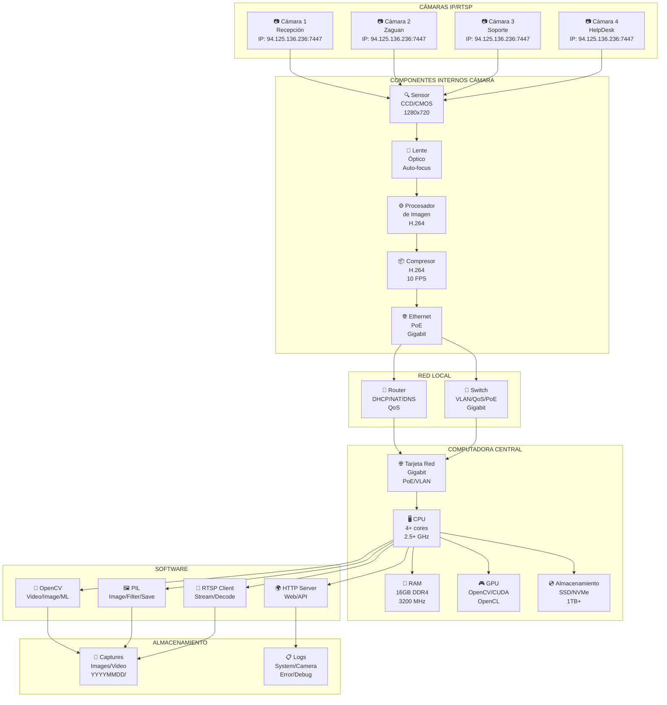
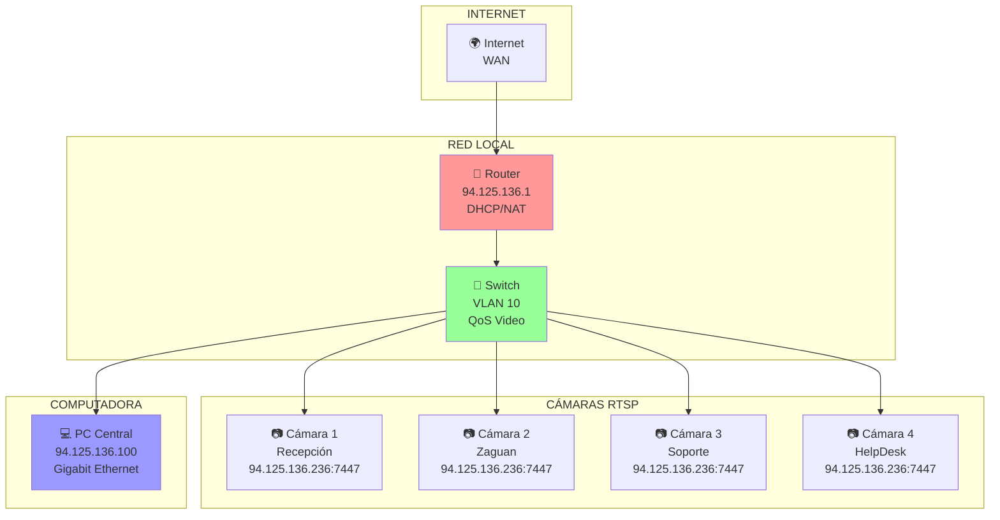
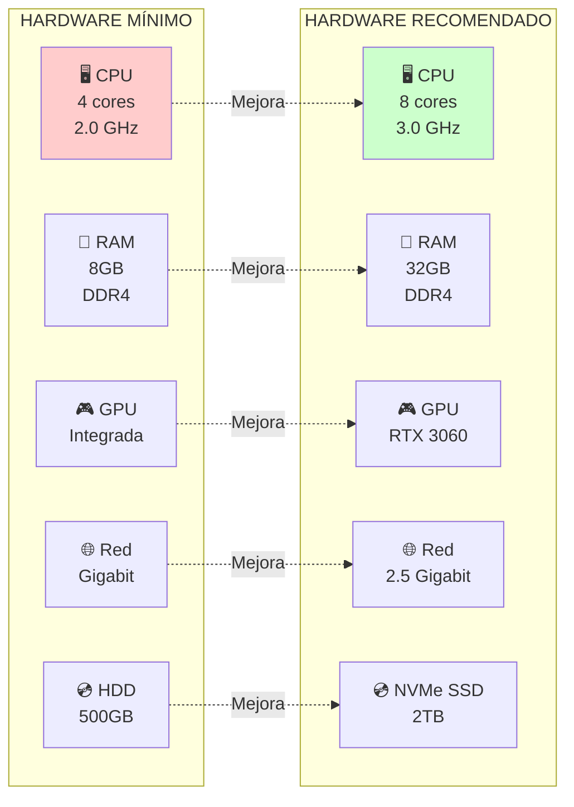
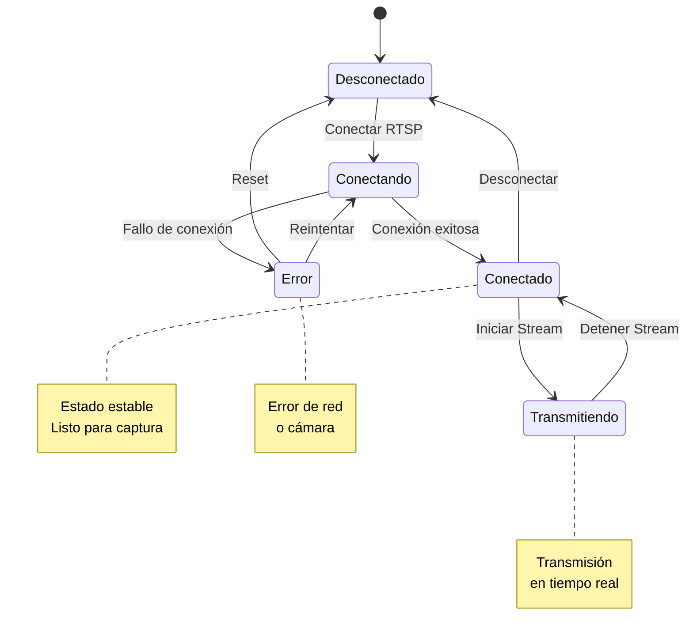
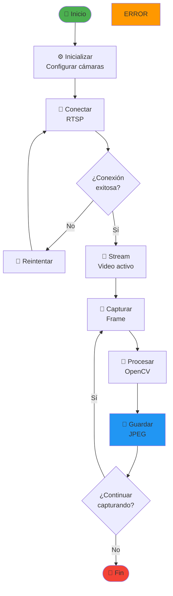
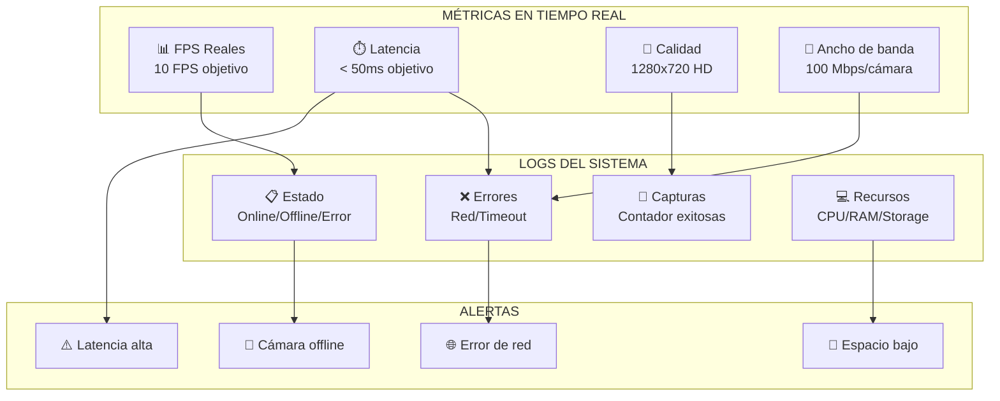

# Diagramas Mermaid de Hardware: Visión por Computadora

## 1. ARQUITECTURA FÍSICA DEL SISTEMA

### Diagrama de Componentes del Hardware

## 2. FLUJO DE DATOS EN TIEMPO REAL

### Timeline de Procesamiento Hardware

```mermaid
gantt
    title Timeline de Procesamiento Hardware (0-50ms)
    dateFormat X
    axisFormat %Lms
    
    section Cámaras
    Luz → Sensor     :0, 5
    Sensor → A/D     :5, 10
    A/D → Procesador :10, 15
    Procesador → H.264 :15, 20
    H.264 → Ethernet :20, 25
    
    section Red
    Ethernet → Router :25, 30
    Router → Switch   :30, 35
    Switch → PC      :35, 40
    
    section Computadora
    Red → CPU        :40, 45
    CPU → OpenCV     :45, 50
    OpenCV → Storage :50, 55
```

## 3. DIAGRAMA DE FLUJO DE SEÑALES

### Flujo de Señales desde la Luz hasta el Almacenamiento

```mermaid
flowchart LR
    subgraph "CAPTURA ÓPTICA"
        A[💡 LUZ AMBIENTE] --> B[🔭 LENTE ÓPTICO]
        B --> C[🔍 SENSOR CCD/CMOS]
    end
    
    subgraph "CONVERSIÓN"
        C --> D[⚡ CONVERSIÓN A/D]
        D --> E[🖥️ PROCESAMIENTO]
        E --> F[📦 COMPRESIÓN H.264]
    end
    
    subgraph "TRANSMISIÓN"
        F --> G[🌐 ETHERNET RTSP]
        G --> H[🔄 ROUTER]
        H --> I[🔌 SWITCH]
    end
    
    subgraph "PROCESAMIENTO"
        I --> J[💻 TARJETA RED]
        J --> K[🖥️ CPU]
        K --> L[🎮 GPU]
    end
    
    subgraph "SOFTWARE"
        L --> M[🔧 OpenCV]
        M --> N[🖼️ PIL]
        N --> O[💾 ALMACENAMIENTO]
    end
    
    style A fill:#ffff00
    style O fill:#00ff00
    style M fill:#00ffff
```

## 4. DIAGRAMA DE CONECTIVIDAD DE RED

### Topología de Red para Cámaras RTSP

## 5. DIAGRAMA DE ESPECIFICACIONES TÉCNICAS

### Comparación de Hardware Mínimo vs Recomendado

## 6. DIAGRAMA DE ESTADOS DE CONEXIÓN

### Estados de Conexión de las Cámaras

## 7. DIAGRAMA DE FLUJO DE CAPTURA

### Proceso de Captura de Imagen

## 8. DIAGRAMA DE MONITOREO

### Sistema de Monitoreo y Logs

---

**Nota**: Estos diagramas Mermaid están optimizados para mostrar la arquitectura de hardware y pueden ser utilizados en:
- **GitHub/GitLab**: En archivos README.md
- **Notion**: Con soporte Mermaid
- **Documentación técnica**: Herramientas que soporten Mermaid
- **Presentaciones**: Exportando como imágenes
- **Mermaid Live Editor**: Para edición y visualización online
