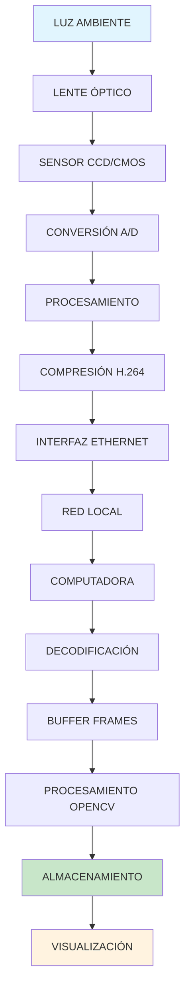
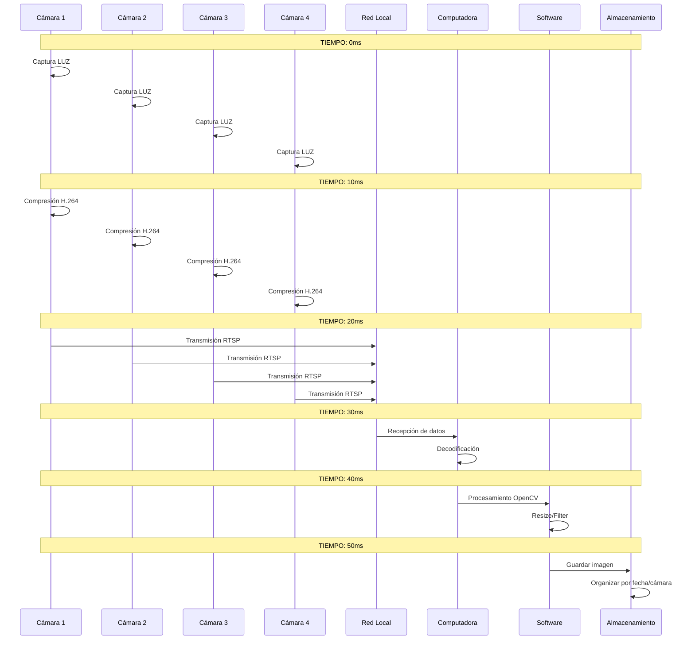
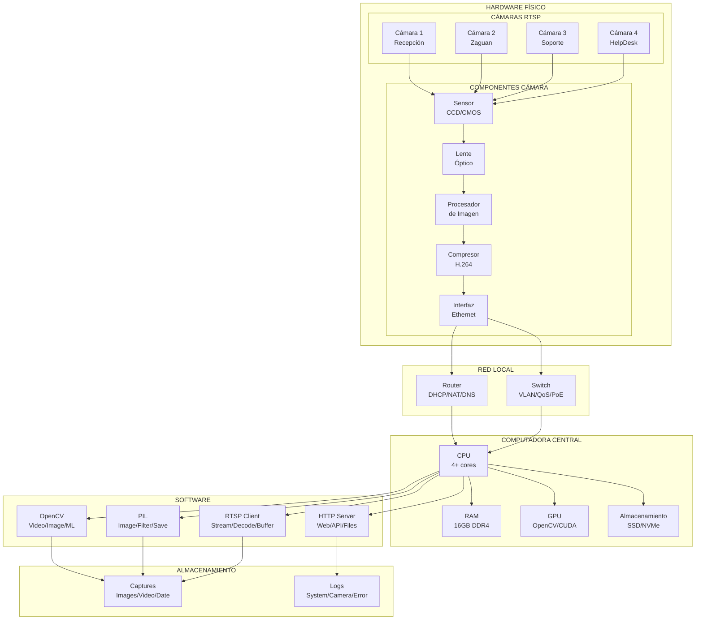
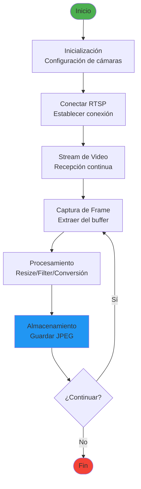
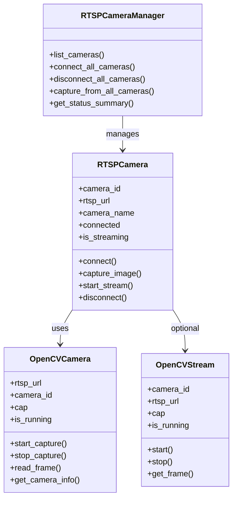
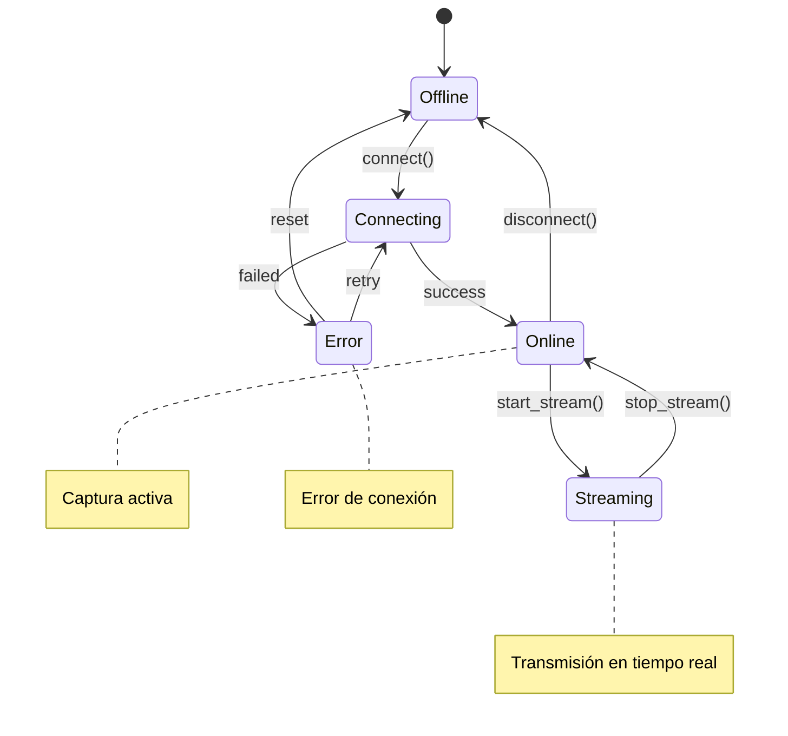
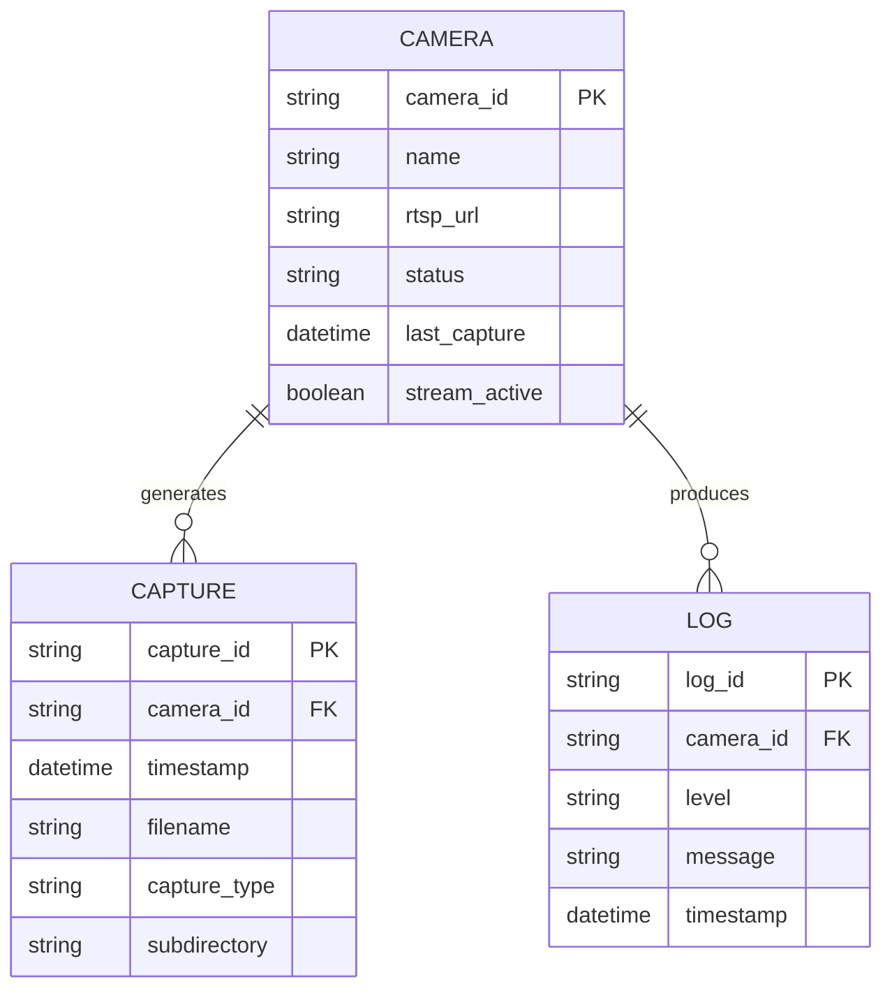

# Diagrama de Procesos Mermaid: Hardware de Visión por Computadora

## 1. DIAGRAMA DE FLUJO PRINCIPAL

### Flujo del Sistema Completo

## 2. DIAGRAMA DE SECUENCIA

### Flujo de Datos en Tiempo Real

## 3. DIAGRAMA DE COMPONENTES

### Arquitectura del Sistema

## 4. DIAGRAMA DE FLUJO DETALLADO

### Proceso de Captura Completo

## 5. DIAGRAMA DE CLASES

### Estructura del Software

## 6. DIAGRAMA DE ESTADOS

### Estados de la Cámara

## 7. DIAGRAMA DE ENTIDAD-RELACIÓN

### Estructura de Datos

## 8. DIAGRAMA DE TIMELINE

### Timeline de Procesamiento

```mermaid
gantt
    title Timeline de Procesamiento de Imágenes
    dateFormat X
    axisFormat %Lms
    
    section Captura
    Luz Ambiente     :0, 5
    Sensor CCD/CMOS  :5, 10
    Conversión A/D   :10, 15
    
    section Compresión
    Procesamiento    :15, 20
    Compresión H.264 :20, 25
    Transmisión      :25, 30
    
    section Red
    Router           :30, 35
    Switch           :35, 40
    
    section Computadora
    Decodificación   :40, 45
    Procesamiento    :45, 50
    Almacenamiento   :50, 55
```

---

**Nota**: Estos diagramas Mermaid pueden ser utilizados en plataformas que soporten la sintaxis Mermaid como:
- GitHub (en archivos .md)
- GitLab
- Notion
- Mermaid Live Editor (online)
- Herramientas de documentación técnica
